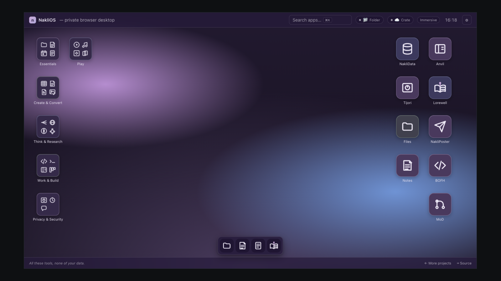

# NakliOS



A private, browser-native desktop for single-file tools. Apps stay standalone; NakliOS gives them a home — a spotlight (⌘K), themed wallpapers, task-based folders, an Essentials dock, sticky notes, and windowed apps that feel native inside the OS.

**Try it: [naklios.dev](https://naklios.dev/)**

`naklios.dev` is the canonical origin. `naklios.com` and
`www.naklios.com` use the versioned Worker under
[`redirects/naklios-com/`](redirects/naklios-com/) to preserve the request
path and query while redirecting to the canonical origin.

Dozens of privacy-first tools, games, and utilities — each a single HTML file that runs entirely in your tab. A new profile starts with one skippable welcome action that creates a real Browser-backed note; storage setup waits until it is actually needed. The desktop is grouped into Essentials, Create & Convert, Think & Research, Work & Build, Privacy & Security, and Play. No build step, backend, or telemetry.

## Modes

- **Immersive** — the default for new profiles. Compatible apps open in responsive NakliOS windows on desktop and mobile; apps that cannot embed still open in a tab.
- **Basic** — built-ins and storage-dependent system apps stay hosted; other web apps open in new tabs. An existing explicit Basic preference is preserved.

Basic is a compatibility and user-choice fallback, not a second desktop
generation. The [`Experience mode policy`](docs/experience-modes.md) records
the keep decision, invariants, and historical-key migration.

Every NakliOS window has an **App Info** button in its titlebar. It shows the
actual loaded URL and origin, iframe sandbox tokens, load/SDK-ready timings,
the storage capabilities currently offered to that app, and whether the
artifact is built in, canonical, or a mirror locked to a source commit and
SHA-256.

## Adding apps

People can install a personal web app from **Settings → Apps → Add app from
manifest**. The versioned
[`third-party app standard`](docs/third-party-apps-v1.md) defines identity,
themes, lifecycle, app-scoped storage, permissions, sandboxing, updates,
accessibility, and acceptance checks. Personal registrations are profile-local.
Windowed apps are always opaque-origin sandboxed; apps that require their own
origin state can explicitly open in a normal top-level tab. Neither route
becomes a privileged mirror.

Maintainers add a first-party catalog app in source:

One line in the `APPS` array at the top of `index.html`:

```js
{ id:'mynewapp', name:'MyNewApp', url:'https://mynewapp.naklitechie.com',
  glyph:'✨', bg:'brand',
  description:'One-sentence pitch.',
  tags:['tool','ai'] }
```

Optional fields: `maxMode:'basic'`, `iframeable:false`, `private:true`, `kind:'classic'`, `desktopAlign:'right'` + `desktopOrder:N`, `svg:'<path d=…>'`, `embedUrl:'https://naklios.dev/apps/<id>/'` (same-origin mirror for FSA-needing apps; see `apps/manifest.json`).

Apps retain one predictable task-folder home. NakliOS also places Lorewell,
NakliPoster, BOFH, MoD, NakliData, Tijori, Files, and Notes on the right side
of the desktop by default; users can return any shortcut to its folder from
the desktop context menu.

NakliData opens as a top-level app rather than an opaque sandboxed iframe
because its browser-native data engine relies on File System Access, OPFS,
workers, and cross-origin isolation.

First-party stateful and cooperative apps should follow the
[`NakliOS app contract`](docs/app-contract.md), including backend-affine
filesystem calls, separate Browser/Folder/Crate libraries, async close
durability, explicit remote-conflict handling, and the optional streamed
chat and image-generation surfaces under `naklios.ai`.

### Standalone apps go native inside NakliOS (`?naklios`)

An app doesn't need a NakliOS-specific build to feel native. When it's embedded
in a NakliOS window — or opened standalone with the `?naklios` flag — it routes
its filesystem and AI through the host via the vendored `naklios.js` SDK; run on
its own, the exact same source falls back to its native APIs. Detection never
depends on the referrer (the host embeds apps with `referrerpolicy="no-referrer"`),
and the SDK learns the trusted host origin on first contact, then targets every
message to it. `?naklios` is a **hint**, not a channel: it sets
`naklios.capabilities.hosted` so an app knows to route through NakliOS, but the
transports only activate against a real host frame, so a bare `?naklios` top-level
tab with no NakliOS around it safely falls back — detect, attempt, fall back.
See "Detecting the host" and the transport-adapter pattern in the
[app contract](docs/app-contract.md).

The bundled Calendar lives in Essentials and provides month, week, and day
views, recurring-series CRUD with IANA time-zone handling, and ICS
import/export. Browser, Folder, and Crate each remain a separate calendar.

The bundled Editor lives in Work & Build. It is the developer workspace—tabs,
project tree/search, find/replace, commands, backend subscriptions, and
independent per-file crash recovery—while Notepad remains the fast general
text/Markdown tool. Files can hand one selected text file to Editor through an
explicit, window-lifetime exact-file grant; no app namespace is broadened.

## AI

NakliOS has one host-owned inference broker backed by pinned LocalMind
runtimes. LFM2.5 230M remains the fast ~140 MB default. Settings also offers
Gemma 4 E2B, Gemma 4 E4B, and Qwen3.5 4B through pinned Transformers.js
4.2.0/WebGPU, or an
OpenAI-compatible endpoint: Ollama, LM Studio, llama.cpp, OpenAI, OpenRouter,
Groq, or a custom provider. Cooperative apps keep one SDK regardless of which
runtime the user chooses. Requests are bounded, queued fairly, reset between
apps, streamed, and cancellable.

Inference is **split by tier.** General-purpose (non-agent) completions — the
Spotlight ask, a quick summary, any desktop query — default to the browser's
built-in **Gemini Nano** on-device model whenever Chrome exposes it (zero setup,
nothing downloaded, nothing leaves the device), and fall back to a LocalMind
runtime or a configured endpoint otherwise. The **agent tier** — the coding
agents below, or any `agent:true` request from a system app — is separate: it
always uses the configured OpenAI-compatible endpoint and never a
general-purpose on-device model, because coding needs reliable tool-calling.
There is no silent weak-model fallback; with no coding endpoint set, the agent
tier degrades honestly rather than answering with a weak model.

The same broker exposes image generation through
`naklios.ai.images.generate(...)`. The default image runtime is LocalMind's
private, on-device Bonsai FLUX.2-Klein WebGPU engine. Users may instead connect
OpenAI or a compatible `POST /images/generations` endpoint. Chat and image
generation share a fair queue but have separate model settings and consent;
the host does not keep both large WebGPU workers resident at once.

Consent is per app, capability, browser, and destination. A grant for a browser-local model
does not silently authorize a local server or cloud provider. Endpoint URLs and
API keys remain host-only; keys last for the tab unless the user explicitly
chooses to remember one on that device. AI settings and secrets never sync
through Folder or Crate. Apps receive only their own text stream or generated
image: never the
worker, endpoint credentials, another app's prompts, filesystem capabilities,
Crate credentials, or host tools. Third-party manifests must declare
`inference`, followed by a separate first-use prompt.

LocalMind remains the source repository for inference runtime work. NakliOS
checks in the tested workers, catalog, and engine under
[`vendor/localmind/`](vendor/localmind/) with an upstream commit and SHA-256
lock, so the full LocalMind workbench and the shared OS service cannot drift.

## Coding agents — Forge + Anvil

NakliOS ships two on-device coding agents built on **Rig**, an in-browser
file/git/shell substrate. Both run entirely in the tab — nothing leaves your
device — and are same-origin system apps (`apps/forge/`, `apps/anvil/`) so File
System Access and cross-origin isolation (Python via Kiln/Pyodide) work inside
Immersive mode.

- **Forge** — a bash-style terminal over your files and git (`ls`, `cat`,
  `grep`, `sed`, pipes, globs, `git`, and more) with a real agent loop:
  `agent "<task>"` drives surgical file tools (read/write/edit/apply_patch) and
  the shell to completion.
- **Anvil** — the GUI sibling: a coding-agent desktop with projects and tasks, a
  chat showing the agent's live tool-call trace, a diff/preview pane with
  per-change revert, plan/code/ask modes, and an optional verify gate (the agent
  is not "done" until your command exits 0).

Anvil's capabilities are at parity with desktop coding agents:

- **Edit robustness** — a 9-strategy replacer chain plus a read-before-edit
  ledger, so an edit lands even when whitespace drifts and never touches content
  the agent has not seen.
- **Skills** (`.anvil/skills/<name>/SKILL.md`) and **structured Memory**
  (`.anvil/memory/`, one fact per file) on one progressive-disclosure mechanism —
  only the descriptions load into context; the full item is fetched on demand.
- **Hooks** (`.anvil/hooks.json`) — per-project pre/post-tool shell hooks
  (auto-format, lint, policy) without touching the agent core.
- **Supervisor + parallel subagents** — `dispatch` fans independent sub-tasks to
  subagents that run **in parallel**, each isolated in a copy-on-write overlay of
  the workspace (a browser-native "worktree"); their changes merge back
  automatically when they touch different files, and any conflict is held for you
  to resolve. `review` spawns an independent read-only reviewer for a second
  opinion. Only a subagent that finishes cleanly is merged.
- **Remote git** — `git clone` / `fetch` / `push` to GitHub/GitLab, with all
  network I/O routed through the [sovereign egress](#egress--sovereign-cross-origin-fetch-nakliosnet)
  below. Your token is injected host-side, so the coding agent never sees it.

The agent tier calls your configured endpoint (Settings → AI) for inference; see
the tier split in [AI](#ai) above.

## Egress — sovereign cross-origin fetch (`naklios.net`)

Some things a browser tab simply can't do: push to GitHub, fetch a page for
research, call an API that sends no CORS headers. The Same-Origin Policy blocks
them. NakliOS adds one primitive for all of it —

```js
naklios.net.fetch({ url, method, headers, body }) // -> { status, headers, body }
```

— and routes it to a backend **you** configure. It is **never a naklios-hosted
proxy:** a shared relay would put every user's code and tokens through our server.
Two sovereign backends instead:

- **`nakli-egress`** — a Cloudflare Worker *you* deploy on *your* account
  ([`nakli-egress/`](nakli-egress/)). Every request carries an HMAC-signed envelope
  (bad signature / stale timestamp / replayed nonce are rejected); a default-deny
  **destination allowlist** and an SSRF guard bound where it can reach; it forwards
  headers verbatim, logs nothing, and is stateless. Deleting the Worker revokes
  egress instantly.
- **`nakli-local-bridge`** — a helper on your own machine, for reaching
  host-local services (on-device inference at `localhost`, LAN) and, as the
  maximal-privacy path, egress that never touches any cloud.

Honest scope: a web app can't tunnel TLS, so the relay does see the plaintext it
forwards — the guarantee is that the relay is **your** infrastructure (your
Worker, stateless, single-tenant), not ours. Egress is **opt-in**; the core
(local files, local git, local AI) needs none of it.

Consumers today: Anvil's remote git (`clone`/`fetch`/`push`). Git auth is a
Personal Access Token held **host-side** and injected as the request leaves for
your Worker — the coding agent never sees it. Next: browsing/RAG and any no-CORS
API over the same primitive, and secrets moving into an encrypted vault.

## Reaching a local daemon (Compos relay)

The other half of egress is **rendering a program running on the user's own
machine** inside a public `naklios.dev` page. The canonical prototype is
[`prototypes/compos/`](prototypes/compos/), built around
[`svs/compos`](https://github.com/svs/compos). NakliOS carries Compos's native
Phoenix LiveView client over HTTP and WebSockets; Compos remains the source of
truth for buffers, windows, agents, commands, persistence, and rendering.

Getting a public HTTPS page to a loopback daemon requires a protocol-level path:

- **WebSockets are not CORS-gated.** The Compos relay checks every supplied
  `Origin`, including WebSocket upgrades.
- **Mixed content and Private Network Access apply.** The public page reaches
  `https://local.naklios.dev:9130`, where public DNS resolves to `127.0.0.1`.
  The setup helper uses `mkcert` to create a unique locally trusted certificate.
- **The daemon needs an application boundary.** The relay reverse proxies only
  Compos's native HTTP and WebSocket client. It never exposes the unauthenticated
  `~/.compos/sock` JSON-RPC surface.
- **Pairing is explicit.** A one-time random code creates an in-memory HttpOnly
  session. Every proxied request and upgrade requires that session.
- **Setup uses public source and a local key.** `compos-relay.naklios.dev` serves
  the branded relay and an explicit `mkcert` helper. No private key is published.

Setup guide:
[`naklios.dev/prototypes/compos/guide`](https://naklios.dev/prototypes/compos/guide).

## Mirroring an app for same-origin embedding

Cross-origin iframes can't invoke `showDirectoryPicker()`. To embed a File-System-Access-using app inside Immersive mode, mirror it under `apps/<id>/` so it loads from `naklios.dev` itself.

### One-time per app

1. Add an entry to [`apps/manifest.json`](apps/manifest.json) pointing at the upstream repository, release ref, and distributable files. Prefer a release tag; `main` is supported and is resolved to an exact commit during sync.
2. Set `embedUrl: 'https://naklios.dev/apps/<id>/'` on the app's `APPS` entry in `index.html`.
3. In the upstream source repo, add a small dispatcher workflow at `.github/workflows/notify-naklios.yml`:

   ```yaml
   name: Notify NakliOS to re-mirror
   on:
     push:
       branches: [main]
       paths: ['index.html']
   jobs:
     trigger:
       runs-on: ubuntu-latest
       env:
         DISPATCH_TOKEN: ${{ secrets.NAKLIOS_DISPATCH_TOKEN }}
       steps:
         - if: env.DISPATCH_TOKEN != ''
           run: gh workflow run sync-mirrors.yml --repo NakliTechie/nakli-dev --ref main
           env:
             GH_TOKEN: ${{ env.DISPATCH_TOKEN }}
         - if: env.DISPATCH_TOKEN == ''
           run: echo "Using nakli-dev's scheduled-sync fallback."
   ```

4. For near-immediate updates, add the optional secret `NAKLIOS_DISPATCH_TOKEN` in that source repo (Settings → Secrets and variables → Actions). It's a fine-grained PAT with **Actions: Read and write** on `NakliTechie/nakli-dev`, and can be reused across source repos. Without it, the dispatcher exits successfully and NakliOS's six-hour scheduled sync discovers the update.

5. Run `bash scripts/sync-mirrors.sh --app <id>` locally once to seed the initial mirror and [`apps/manifest.lock.json`](apps/manifest.lock.json), then commit both. `node scripts/validate-mirrors.mjs` verifies that every checked-in artifact matches its locked SHA-256.

### How updates flow

When a source repo pushes to main with a distributable change, its dispatcher fires `gh workflow run` against nakli-dev when the optional dispatch token is configured; a six-hour schedule is the fallback. The `Sync app mirrors` workflow resolves the requested ref to a full Git commit, downloads from that immutable commit, updates the lockfile, validates every artifact hash, and opens a PR if anything drifted. You review + merge → Cloudflare redeploys naklios.dev with the fresh mirror.

This is vendoring of built artifacts, not a second source tree: implementation and releases happen in each standalone repository, while NakliOS records only the deployable snapshot it needs. The Immersive iframe drops its sandbox only for a declared same-origin mirror; standalone visits and new-tab opens continue to use the canonical `url`, and all other hosted apps keep the cross-origin sandbox boundary.

Manual trigger anytime: Actions tab → **Sync app mirrors** → **Run workflow**.

### Keeping a vendored SDK fresh

Cross-origin and single-file apps can't `<script src>` the canonical
`naklios.js`, so they inline it — and an inlined copy silently rots when the SDK
hardens. To prevent drift, the vendored SDK lives between `naklios-sdk` markers,
and each app re-splices it from
[`naklios.dev/sdk/naklios.js`](sdk/naklios.js) on its **own** CI
([`scripts/vendor-naklios-sdk.mjs`](scripts/vendor-naklios-sdk.mjs) plus a daily
`vendor-sdk.yml` from [`docs/vendor-sdk.workflow.yml`](docs/vendor-sdk.workflow.yml),
opening a PR on change). The app pulls; NakliOS never pushes, so no cross-repo
tokens. [`scripts/check-vendored-sdk.mjs`](scripts/check-vendored-sdk.mjs) is the
fleet drift report. This is the same "standalone source of truth, vendored
snapshot" discipline as app mirroring, applied to the SDK itself; see "Vendoring
the SDK" in the [app contract](docs/app-contract.md).

## Storage backends — Folder + Crate

Cooperative apps that want persistent state use the `naklios.fs.*` SDK surface. The host fulfils those calls with one of two backends, configured in Settings:

- **Folder (local)** — a directory you pick via File System Access. Lives on disk. Multi-device only via iCloud Drive / Dropbox / Google Drive of your choice.
- **Crate (cloud, encrypted)** — BYOK end-to-end-encrypted folder on Cloudflare R2. Multi-device sync is built in. Connect with the `.crate-creds` file from [crate.naklios.dev](https://crate.naklios.dev/), or enter the bucket name, account ID, API keys, and folder passphrase directly.

Both can be connected at the same time. On first use, each app is asked which backend to store its data in, and cooperative apps can surface that same choice in their own storage picker. NakliOS confirms every explicit rebind, remembers it per app, and does not copy or delete data when switching. Apps see the same `apps/<id>/` layout regardless of backend, so the same source code works against either.

**Files intentionally has no Browser-backed virtual filesystem.** It browses only
its app-scoped data in a connected Folder or Crate, and routes disconnected
users directly to NakliOS Storage settings.

The Crate ESM modules are vendored under [`vendor/crate/`](vendor/crate/) and loaded dynamically the first time the user clicks **Connect Crate** — zero cost for users who don't opt in.

## Base utilities

**Notepad v2** is a practical multi-document editor with horizontal open-document tabs, autosave, search/replace (including case-sensitive and regular-expression modes), go-to-line, Markdown edit/split/preview modes, local file open/Save As, import/download, word wrap, font and tab-size controls, keyboard shortcuts, and reviewed Local AI summarize/improve/proofread actions. Persistence follows a deliberate order: an app-scoped NakliOS Folder or Crate whenever one is connected, durable local file handles when working from this device, then an IndexedDB recovery/session journal (with the former localStorage registry retained only as a compatibility fallback). The journal restores open tabs and newer unsaved text after a crash, reload, or shutdown. Switching locations never migrates data implicitly, and the original v1 scratch value is preserved after one-time migration.

**Lorewell** remains hosted in both desktop modes under the stable `books` app
ID. It uses the current storage SDK, keeps Folder and Crate libraries isolated,
and adds filtering, sorting, duplicate protection, modal-confirmed removal,
reader appearance preferences, and a Local AI reading companion scoped to the
visible selection, page, or passage. Local development loads the sibling
`Books/` checkout; production uses `lorewell.naklitechie.com`.

**Notes v1** is a bundled three-pane notebook app that stays hosted in both
desktop modes. Browser, Folder, and encrypted Crate are visibly separate
libraries: switching locations never copies or deletes notes. Notes autosaves
Markdown content and separate JSON metadata, restores its library after
reloads, supports notebooks, full-text search, pinning, and soft deletion, and
uses `naklios.fs.subscribe()` for live storage-change notifications when the
host backend supports them. It complements Notepad: Notes manages a library;
Notepad opens arbitrary files.

**Draft**, **Reckon**, and **Sheaf** round out the productivity set in Create &
Convert — Draft a private browser word processor for rich-text documents, Reckon
a private browser spreadsheet with formulas, sorting, and charts, and Sheaf a
private browser PDF editor (merge, split, reorder, and on-device OCR). All keep
files on your device via the File System Access API and are mirrored under
`apps/` for same-origin embedding in Immersive mode.

## License

MIT. See [LICENSE](LICENSE).

---

Part of the [NakliTechie](https://naklitechie.github.io/) series — single-file, browser-native, no-backend tools.
