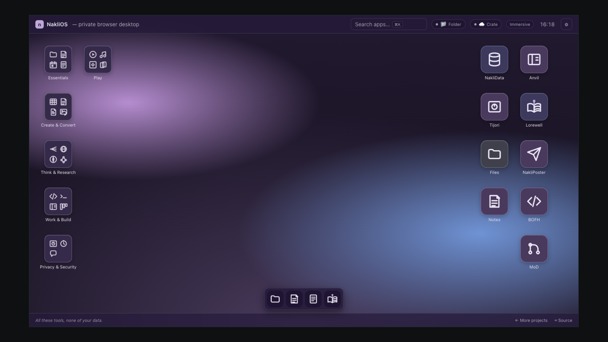

<h1 align="center">NakliOS</h1>

<p align="center"><strong>A browser desktop that brings your tools, files, and coding agents into one workspace.</strong></p>
<p align="center">Storage you choose. Optional AI. No NakliOS account. No build step.</p>
<p align="center">
  <a href="LICENSE"></a>
  
</p>



## Install

| Platform | Start here |
| --- | --- |
| Desktop or mobile browser | Open [naklios.dev](https://naklios.dev/). The browser's install action can add it as an app. |
| macOS, Linux, Windows development | Install Node 24 and Git, then run the source checkout below. |

Create the welcome note, or open an app from a task folder.
The desktop's search opens with ⌘K or Ctrl+K. For a local checkout:

```sh
git clone https://github.com/NakliTechie/nakliOS.git
cd nakliOS
node scripts/serve-coi.mjs
```

Open `http://127.0.0.1:8947/`; the server supplies the headers needed by Forge and Anvil.
No package installation or NakliOS account is required. Try Notes with Browser storage before connecting a folder, cloud storage, or AI.

## Why

Your notes, files, media, and coding tasks occupy separate browser tabs with separate storage settings.
NakliOS gives those tools a desktop, app windows, and shared storage and inference settings.
Apps retain their standalone entrypoints.

Use [VS Code](https://code.visualstudio.com/docs/remote/vscode-web#_relationship-to-vs-code-desktop) instead if you need host processes, a full terminal, or desktop extensions.
Use [vscode.dev](https://vscode.dev/) if you only want browser-based repository editing.

## Choose where your work lives

Apps offer storage according to their capabilities: Browser storage, a Folder you select, or encrypted Crate storage on your own Cloudflare R2.
Switching storage does not copy or delete existing data. Files browses connected Folder or Crate storage.
Immersive mode opens compatible apps in windows; Basic mode opens other web apps in tabs. See the [`Experience mode policy`](docs/experience-modes.md).

Local tools need no model. General AI can use supported browser models or your configured endpoint.
Coding agents use the configured endpoint; prompts and selected context go to that provider.
Settings → AI controls the destination. [Storage and AI details](docs/desktop-reference.md) explain grants, credentials, and runtime downloads.

## Edit and automate with Forge and Anvil

Open Forge for a terminal or Anvil for projects, tasks, tool traces, and change previews.
Both execute shell edits, recursive search, loops, functions, substitutions, archives, and structured-data commands over your workspace.
The [Unix command reference](sys/rig/cli/cmds/README.md) lists supported flags, numeric tools, encodings, checksums, and explicit capability refusals.
SQLite uses Kiln's optional Pyodide runtime. Bounded-read commands require a compatible storage backend.

Anvil applies hooks, permission rules, protected paths, and file grants around shell execution.
Its executor accepts staged operations internally and records confirmation receipts.
Stop cancels pending work; an already accepted operation can finish.
The [Kothri handoff](docs/kothri-unix-handoff.md) pins the reusable core; Kothri packaging and public APIs remain future work.

## Add your own tools

Settings → Apps → Add app from manifest installs a personal app for this browser profile.
The [app standard](docs/third-party-apps-v1.md) covers isolation, declared capabilities, lifecycle, and first-use consent.

First-party apps use the [SDK contract](docs/app-contract.md) for host storage and AI.
The [desktop reference](docs/desktop-reference.md#adding-apps) preserves catalog, mirroring, and SDK-vendoring instructions.

## Commands

Run these in Forge after opening a workspace:

```sh
help                                    # list commands, flags, and unavailable capabilities
pwd                                     # show the workspace directory
ls                                      # list its contents
for n in one two; do echo "$n"; done      # run a bounded shell loop
git status                              # inspect an initialized workspace repository
agent "Summarize this project"           # use the configured coding endpoint
```

Anvil exposes the same governed shell through its agent tool; [llms.txt](llms.txt) points coding agents to the contracts.

## Verify it yourself

From the repository root with Node 24:

```sh
node --experimental-vm-modules scripts/test-unix-portability.mjs c3553134571d1d601bfdbf857f6b3df138a6bf4f
node scripts/test-anvil-unix-integration.mjs
node scripts/test-sqlite-browser.mjs
node scripts/test-kiln-network-denial-browser.mjs
```

The browser checks require Chrome and network access for pinned Pyodide assets; failures and incomplete reports fail the gate.
The [full CI workflow](.github/workflows/test.yml) covers the wider desktop; these commands check portability, Anvil dispatch, SQLite, and network denials.
Deployed checks cover Forge archives and Anvil Stop/recovery; the shell remains a documented Unix subset.

## License

MIT. See [LICENSE](LICENSE); vendored dependencies retain their own licenses and provenance files.

[Rig design](sys/rig/RIG-VISION-AND-ROADMAP.md) · [Desktop reference](docs/desktop-reference.md) · [History](https://github.com/NakliTechie/nakliOS/commits/main/) · [llms.txt](llms.txt)
